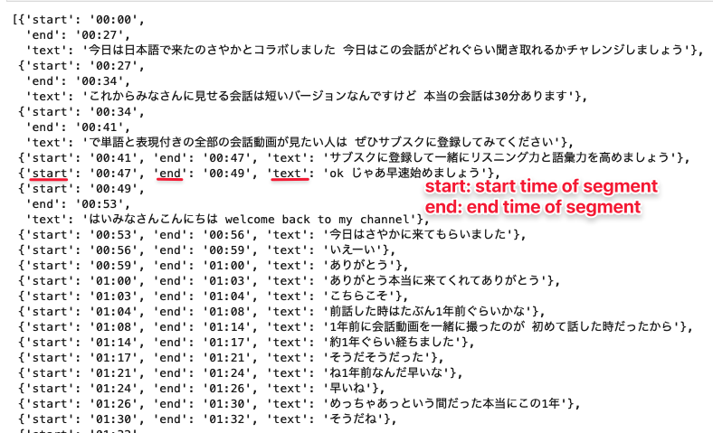

<h1 align="center">Speaker Diarization using OpenAI Whisper and Pyannote</h1>
<p align="center">
    
    
    
</p>

<h3>Table of content</h3>

- [Introduction](#introduction)
- [Prerequisties](#prerequisties)
- [Docker Setup](#docker-setup)
- [Usage](#usage)
- [Screenshots](#screenshots)

## Introduction
Speaker Diarization pipeline based on OpenAI Whispe and Pyannote.

## Prerequisties
- Docker==20.10.7
- Nvidia-Docker

## Docker Setup
I prefer using the Docker because of simplicity. You just need to run the gpu-enabled docker container and everything is setup for you

```
git clone https://github.com/leviethung2103/whisper_speaker_diarization
cd whisper_speaker_diarization
docker run --gpus all -d -it -p 8848:8888 -v $(pwd):/home/jovyan/work -e GRANT_SUDO=yes -e JUPYTER_ENABLE_LAB=yes --user root cschranz/gpu-jupyter:v1.4_cuda-11.6_ubuntu-20.04 
```

## Usage
- Access the jupyter lab via http://localhost:8848 
- Start with jupyter notebook `01_Speaker_Diarizateion.ipynb`. 
- Default password is `gpu-jupyter`


## Screenshots
Here is the output after running modules.

 
